- 

# Urbanization in Antalya
Demonstrate urbanization in a designated area of ​​Antalya using Remote Sensing methods (change detection) to assure the importance of live update status 24/7 in case of an unexpected earthquake.
 
- 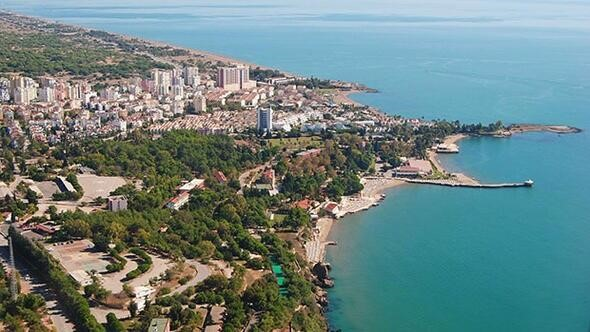
# Study Area: Antalya
```
              population    year  

               1719751     2000     
               1978333     2010     
```


## 2. Landsat 5 image with 30m spatial resolution
 - 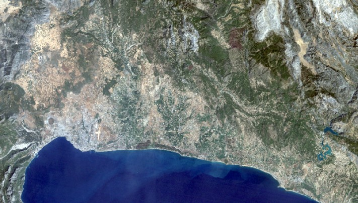
- 29/08/2000 Data (RGB)
 - 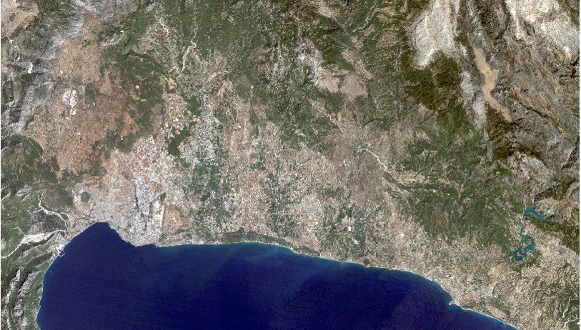
- 25/08/2010 Data (RGB)

### Methodology 
Process techniques:
Supervised Classification (Maximum Likelihood Method)
Thermal method
Tools:

 Arcmap

- 

 Snap
 
- 


# SUPERVISED CLASSIFICATION 
- 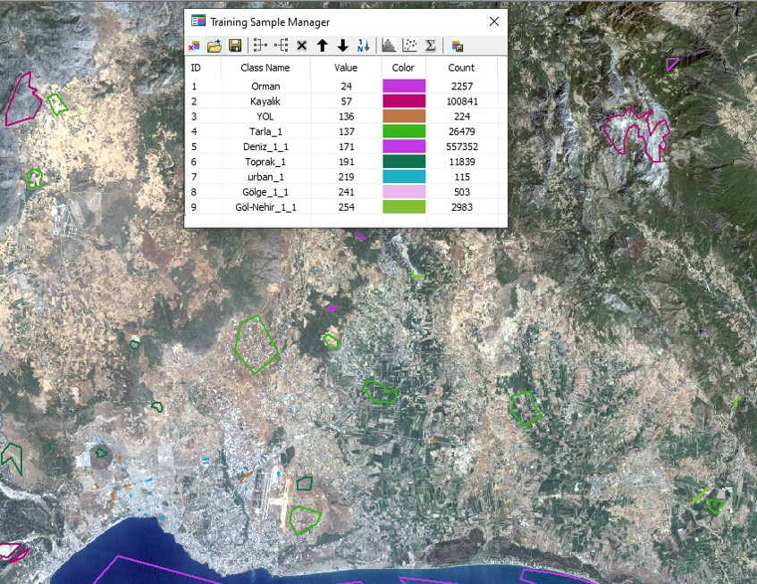

- Sampling process on Arcmap for year 2000 data

# Maximum Likelihood Classification Method
- 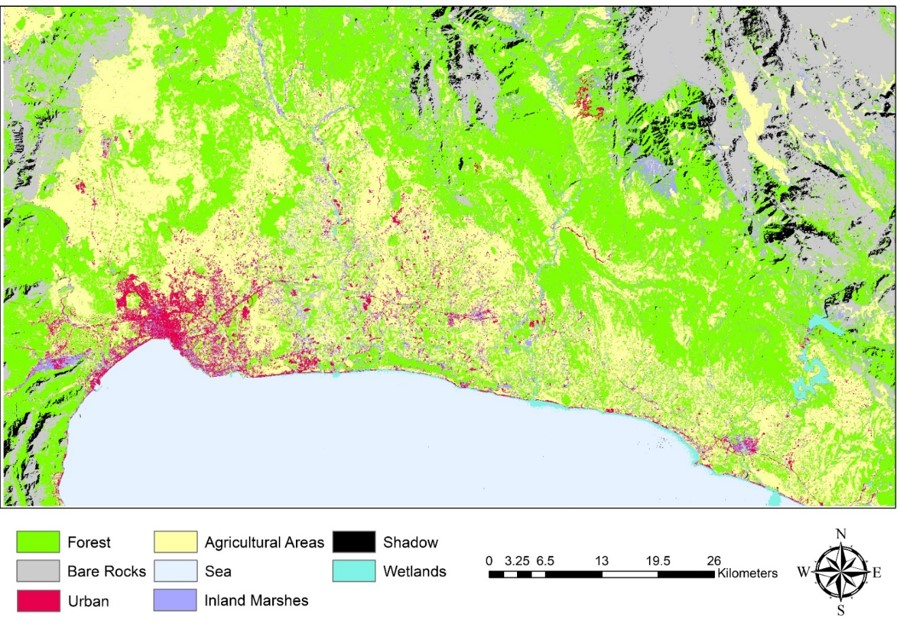

- 2000

- 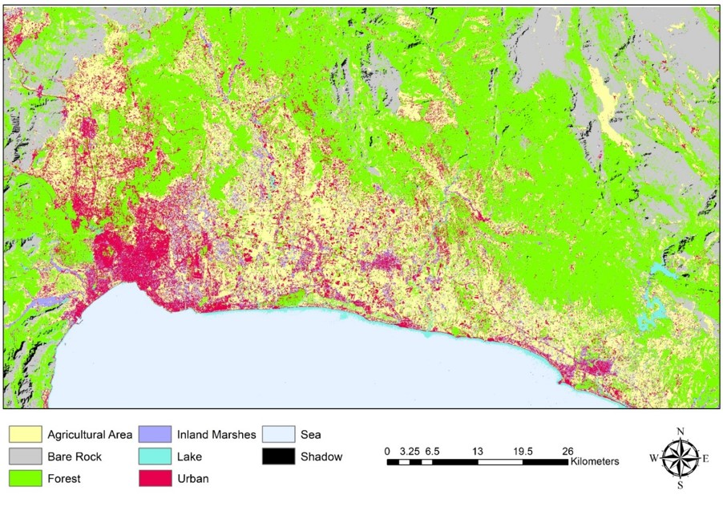

- 2010

# Joined Classes Classification 
- 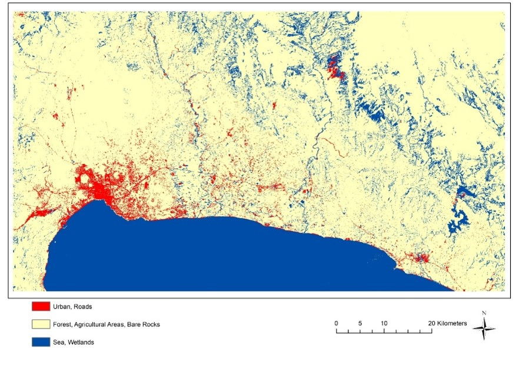

- 2000

- 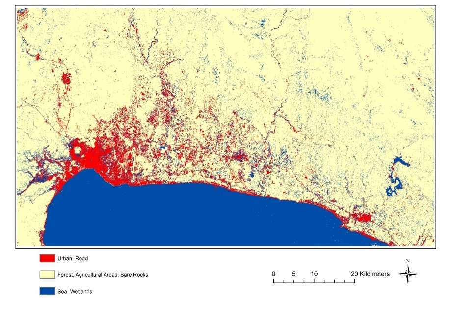

- 2010

# Accuracy Assesment
- 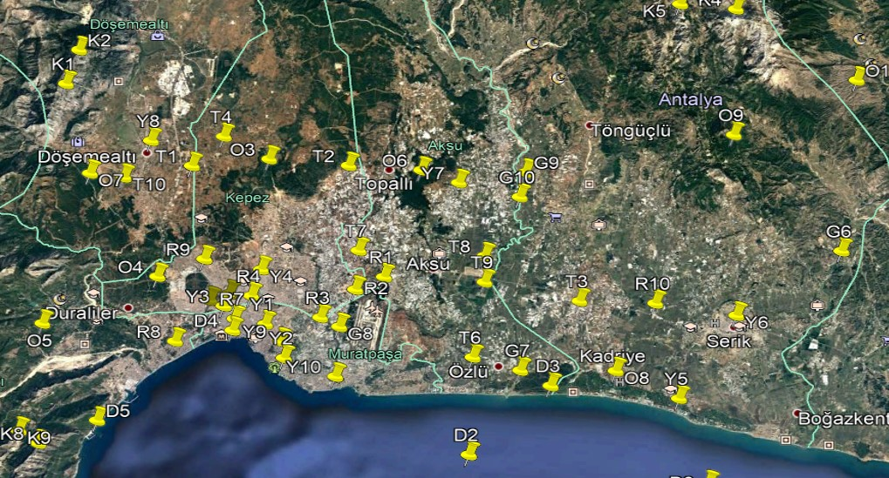

- Control Points on Google Earth for year data

- 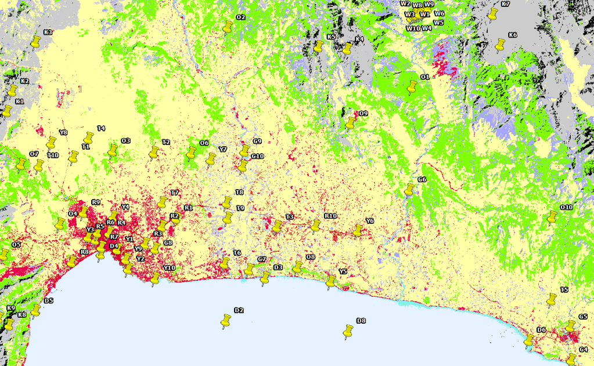

- Control Points on Arcmap for year data

# Both 2000 and 2010 years classified image
- 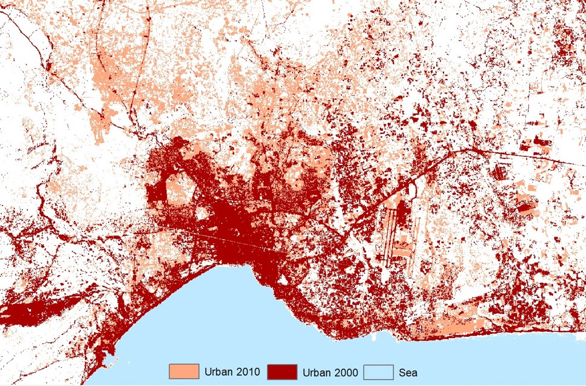

- Referenced Data (2000)

- 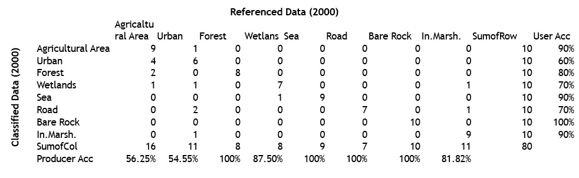

Total Accuracy = 81.25 %
Kappa =  78.77%

- Referanced Data (2010)

- 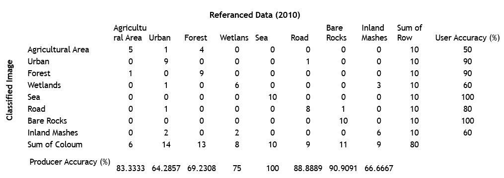

Total Accuracy = 78.75%
Kappa =  75.71%

# Statistical Results
- *Table of Classes by Years.*
- *Urban Area and Road Change by Years.*

 2000

- 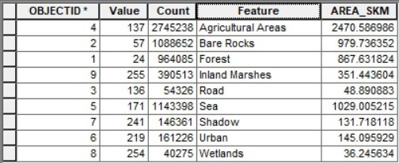

 2010

- 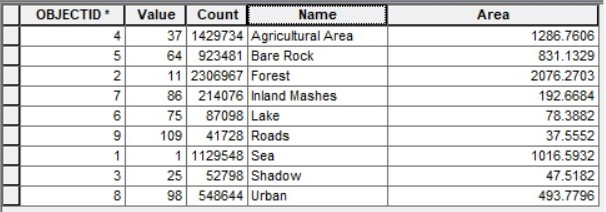

# CONCLUSION
- *Remote sensing live version is needed due to the number of urban increasing by time and to the risk of having an earthquake,however, this operation is located at a very high financial cost.*


